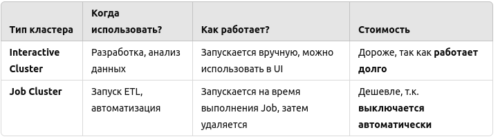
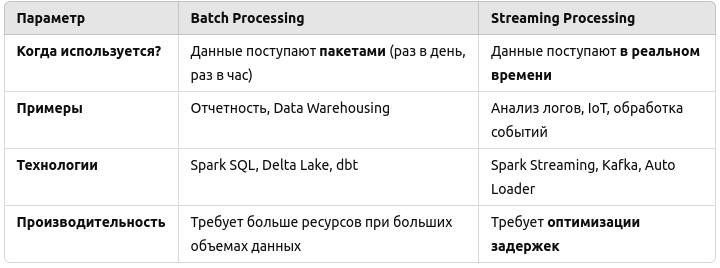
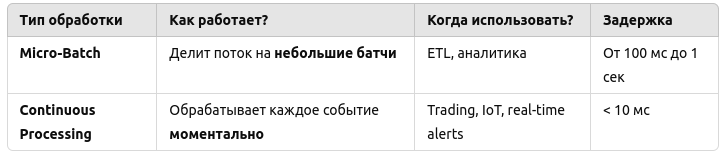
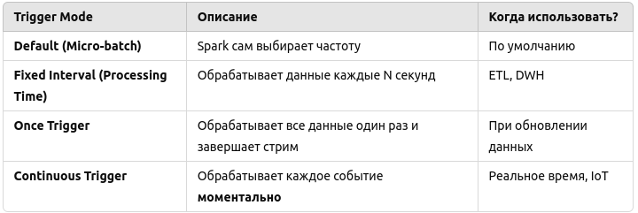
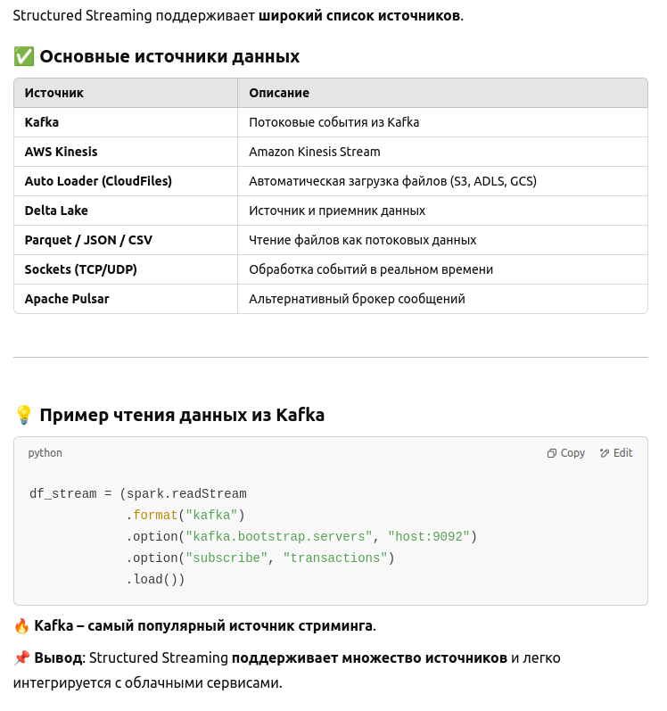
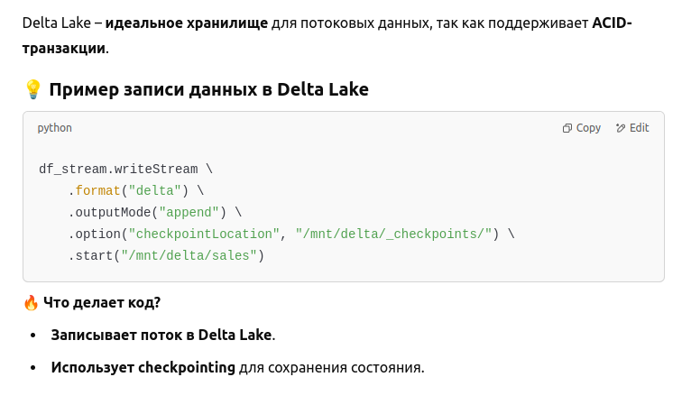
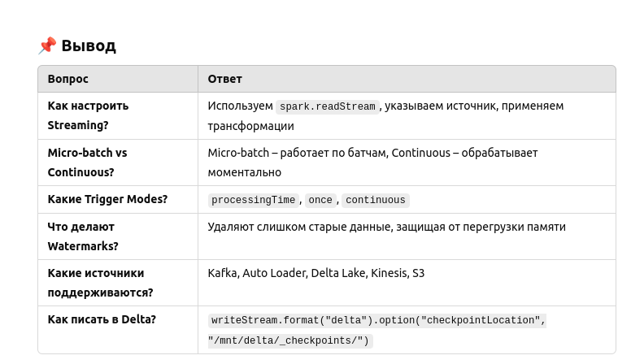

**Основы Databricks**

Что такое Databricks и чем он отличается от традиционного Apache Spark?

Databricks – это облачная платформа для обработки и анализа данных, основанная на Apache Spark. В отличие от классического Spark, Databricks предлагает:

Управляемую среду – не нужно вручную настраивать Spark-кластеры.

Оптимизации для производительности – Photon Engine, Z-Ordering, Adaptive Query Execution (AQE).

Поддержку машинного обучения – встроенная интеграция с MLflow.

Data Lakehouse – объединяет возможности Data Lake (гибкость хранения) и Data Warehouse (SQL-аналитика).

------------------------------------------------
**Какие основные компоненты Databricks?**

Databricks включает в себя:
* Workspace – графический интерфейс для работы с кодом, ноутбуками и ресурсами.

* Clusters – управляемые Spark-кластеры для обработки данных.

* Databricks SQL – мощная SQL-среда для анализа данных.

* Jobs & Workflows – автоматизация ETL и ML-пайплайнов.

* Unity Catalog – управление данными и доступами.

* MLflow – отслеживание экспериментов и развертывание моделей.

------------------------------------------------
**3. Как работает Databricks Lakehouse Platform?**
Databricks Lakehouse объединяет:

* Гибкость Data Lake (храним сырые данные в S3/ADLS/Google Cloud Storage).
* Производительность Data Warehouse (используем SQL-оптимизации, Delta Lake).
* Машинное обучение (MLflow, AutoML).

------------------------------------------------
**4. Архитектура Databricks**
Как устроена архитектура Databricks?

Databricks построен на облачных сервисах (AWS, Azure, GCP) и использует:
* Storage Layer – хранение данных в S3/ADLS/GCS.
* Compute Layer – управляемые Spark-кластеры.
* Control Plane – управление ресурсами, доступами и логами.
* Databricks Runtime – оптимизированная версия Spark.

Разница между Standard, Premium и Enterprise Edition
* Standard – базовый функционал, без Unity Catalog.
* Premium – дополнительные функции безопасности (Role-Based Access Control, Table ACLs).
* Enterprise – максимальная безопасность, поддержка HIPAA и GDPR.

------------------------------------------------
**Кластеры в Databricks**

Как создать кластер в Databricks?

Перейти в Compute → Create Cluster.

Выбрать тип:
* Interactive Cluster (для разработки).
* Job Cluster (для автоматизированных задач).

Настроить параметры (количество узлов, Databricks Runtime, Auto Scaling).

Нажать Create Cluster.

💡 Можно создать через API

"""

import requests

databricks_url = "https://<databricks-instance>/api/2.0/clusters/create"
token = "your-databricks-token"

payload = {
    "cluster_name": "MyCluster",
    "spark_version": "11.3.x-scala2.12",
    "num_workers": 2,
    "node_type_id": "i3.xlarge",
}

headers = {"Authorization": f"Bearer {token}"}
response = requests.post(databricks_url, json=payload, headers=headers)
print(response.json())
""""
-------------------
**Что такое Auto Scaling и как он работает?**

Auto Scaling автоматически увеличивает или уменьшает количество узлов в кластере в зависимости от нагрузки.
💡 Например:
Если загрузка CPU <30% – Databricks уменьшает количество узлов.
Если загрузка CPU >80% – Databricks добавляет узлы.

-----------
**Что такое Photon Engine в Databricks?**

Photon – это новый C++-движок в Databricks, который ускоряет SQL-запросы до 8 раз по сравнению с классическим Spark.

------
**Databricks Notebooks**

Как создать и запустить Databricks Notebook?
Перейти в Workspace → Create → Notebook.
Выбрать язык (Python, SQL, Scala, R).
Написать код и нажать Run.
---------
**Как работают Magic Commands (%sql, %python, %scala, %sh)?**

Magic Commands позволяют использовать несколько языков в одном ноутбуке

-----------

**Оптимизация работы Spark в Databricks**

* **Adaptive Query Execution (AQE) – автоматически оптимизирует запросы.**

* Автоматический выбор размера shuffle partitions (уменьшает их количество, если данных мало).
* Оптимизация соединений (Joins) – Spark автоматически выбирает Broadcast Join вместо Sort-Merge Join.
* Skew Join Optimization – перераспределяет данные, если одна из таблиц сильно несбалансирована.

* **Broadcast Join – ускоряет соединение маленькой таблицы с большой.**

Когда одна из таблиц маленькая, Spark копирует ее на все узлы, что ускоряет JOIN.

Когда использовать Broadcast Join?

* Одна таблица < 10 МБ (можно увеличить до 100 МБ).
* JOIN выполняется часто, и данные редко меняются.

📌 Spark не выполняет shuffle и сортировку, а просто распространяет маленькую таблицу по узлам, что ускоряет работу в 3-5 раз на маленьких таблицах.

* **Z-Ordering – упорядочивает данные по ключам для быстрого доступа.**

Z-Ordering – это метод сортировки данных в Delta Lake, который уменьшает количество сканируемых файлов.

🔹 Как работает Z-Ordering?

* Группирует похожие значения вместе, чтобы ускорить фильтрацию.
* Уменьшает количество читаемых строк при SQL-запросах.
* Работает лучше, чем обычная сортировка (ORDER BY).
* Подходит для колонок, по которым часто выполняются фильтрации.

> %sql 
> 
> OPTIMIZE sales_table ZORDER BY (customer_id);

------
* **Data Skipping – пропуск ненужных данных в Delta Lake.**

Data Skipping – это механизм, который позволяет Spark не читать ненужные файлы при запросах.

🔹 Как работает Data Skipping?

* Delta Lake автоматически сохраняет статистику о каждом файле (минимум, максимум значений в колонках).
* При WHERE Spark не читает файлы, если нужные данные в них отсутствуют.

> SELECT * FROM sales WHERE order_date = '2023-06-01';

Без Data Skipping: Spark читает всю таблицу.

🔥 С Data Skipping: Spark читает только нужные файлы.

* **Caching – кеширование DataFrame в памяти.**

Кеширование позволяет хранить данные в памяти, чтобы ускорить повторные запросы.

🔹 Какие типы кеширования бывают?

* df.cache() – кеширует DataFrame в RAM.
* df.persist(StorageLevel.DISK_ONLY) – хранит данные на диске, если RAM не хватает.
* CACHE TABLE – кеширует SQL-таблицу.

💡 Пример кеширования DataFrame

df = spark.read.parquet("s3://data-lake/sales")

df.cache()

df.count()  # Первая обработка будет медленной

df.show()  # Повторные вызовы будут моментальными

* **Auto Scaling – динамическое добавление узлов в кластере.**

* Если нагрузка увеличивается, Databricks добавляет узлы.
* Если нагрузка снижается, Databricks убирает лишние узлы, экономя деньги.

Databricks самостоятельно регулирует количество узлов.

------------

**Что такое Delta Lake?**

Delta Lake – это расширение для Apache Spark, которое добавляет:

* ACID-транзакции (гарантируют целостность данных).
* Time Travel (история изменений данных).
* Schema Evolution (гибкое обновление схемы).
* Efficient Merge & Upsert (быстрое обновление данных).
* Data Versioning (упрощает откат к старым версиям).

Как сохранить? 

df.write.**_format("delta")_**.mode("overwrite").save("/mnt/delta/sales")

------------
**Что такое Delta Change Data Feed (CDC)?**

Change Data Feed (CDF) – это механизм в Delta Lake, который позволяет отслеживать изменения в данных без полного пересканирования таблицы.

Что позволяет делать CDC?

* Фиксировать только измененные строки – не нужно считывать всю таблицу.

* Эффективно загружать инкрементальные обновления в ETL-пайплайнах.

* Ускорять обработку потоковых данных в Structured Streaming.

Как включить CDC в Delta Lake?
Перед использованием CDF его нужно включить в таблице:

ALTER TABLE sales ENABLE CHANGE DATA FEED;

После этого любые INSERT, UPDATE, DELETE фиксируются в Change Data Table.

Если CDC включен, можно получить только измененные строки:

df_changes = spark.read.format("delta") \
    .option("readChangeData", "true") \
    .option("startingVersion", 5) \
    .load("/mnt/delta/sales")

df_changes.show()

✅ В результате будут только строки, которые изменились после версии 5

-----------------
**Managed / External tables**

В Databricks и Delta Lake есть два типа таблиц:
* Managed Table (управляемая).
* External Table (внешняя).

🔹 **Managed Table:**

Данные хранятся внутри Databricks (на S3, ADLS, GCS).

Databricks управляет схемой, хранилищем и метаданными.

Удаление таблицы удаляет данные.

🔹 **External Table**

Данные хранятся в указанном хранилище (S3, ADLS).

Databricks управляет только метаданными.

Удаление таблицы не удаляет файлы.

------------
**Как оптимизировать Delta Tables?**

🔹 Оптимизация включает три шага:

1) **OPTIMIZE – уменьшает количество файлов**

>_OPTIMIZE sales_

* Объединяет маленькие файлы в крупные (уменьшает I/O).
* Ускоряет SQL-запросы и стриминг.

🔥 После OPTIMIZE файлы сливаются, и SQL-запросы выполняются быстрее.

2) **ZORDER BY – ускоряет запросы по ключевым колонкам**

>_OPTIMIZE sales ZORDER BY (customer_id);_

* Сортирует данные так, чтобы фильтрация была быстрее.
* Работает лучше, чем обычный ORDER BY.

🔥 Если часто используете WHERE customer_id = 123, ZORDER ускоряет поиск.

3) **VACUUM – удаляет старые версии данных**

>_VACUUM sales RETAIN 7 HOURS;_

Удалит все старые версии данных, которым более 7 часов.

* Освобождает место в хранилище.
* Очищает устаревшие данные.

Вывод: OPTIMIZE + ZORDER + VACUUM = супер-быстрая таблица.

--------

**Что такое Databricks Workflows и как автоматизировать задачи?**

Databricks Workflows – это инструмент для автоматического выполнения задач в Databricks.

Что можно автоматизировать?
* Запуск ETL-пайплайнов
* Вызов ноутбуков, SQL-запросов
* Управление зависимостями между задачами
* Подключение к Airflow, Apache Oozie

💡 Как создать Workflow (UI)
1. Перейти в Workflows → Create Workflow.
2. Добавить Jobs (ноутбук, Python-скрипт, SQL, JAR).
3. Настроить расписание (ежедневно, ежечасно, по триггеру).
4. Выбрать кластер для выполнения.

-------

**Разница между Batch Processing и Streaming Processing**

--------------
Как использовать **Auto Loader (CloudFiles)** для обработки данных?

**Auto Loader (CloudFiles)** – это сервис в Databricks для автоматической загрузки новых файлов из облачного хранилища (S3, ADLS, GCS).

Почему Auto Loader лучше?

* Не нужно вручную отслеживать новые файлы – Databricks делает это сам.
* Оптимизирован для обработки миллионов файлов.
* Поддерживает JSON, CSV, Avro, Delta и Parquet.

> df = (spark.readStream
      .format("cloudFiles") \
      .option("cloudFiles.format", "csv") \
      .option("cloudFiles.schemaLocation", "/mnt/delta/schema/") \
      .load("s3://my-bucket/raw-data"))

_Auto Loader автоматизирует ingestion, особенно в streaming ETL-процессах._

--------------
# Streaming в Databricks (Structured Streaming)
Structured Streaming в Databricks – это фреймворк потоковой обработки данных, основанный на Apache Spark, который позволяет обрабатывать данные в реальном времени.

🔹 Что нужно для настройки Streaming?
* Источник данных – Kafka, Kinesis, Auto Loader, S3, Delta.
* Трансформации – агрегирование, фильтрация, объединение.
* Вывод данных – Delta Lake, Snowflake, Redshift, Kafka.
* Checkpointing – для отслеживания состояния стрима.

💡 Пример: Чтение потока данных из Kafka
>df_stream = (spark.readStream\
             .format("kafka")\
             .option("kafka.bootstrap.servers", "broker1:9092")\
             .option("subscribe", "transactions")\
             .load())\
> 
>df_parsed = df_stream.selectExpr("CAST(value AS STRING)")

💡 Пример: Запись стрима в Delta Lake

>(df_parsed.writeStream\
 .format("delta")\
 .option("checkpointLocation", "/mnt/delta/_checkpoints/")\
 .start("/mnt/delta/transactions"))\
> 

Что делает код?

* Читает данные из Kafka.
* Преобразует данные в нужный формат.
* Сохраняет их в Delta Lake (гарантия ACID).
* Использует checkpointing (отслеживание состояния стрима).

-----
**Разница между Micro-batch Processing и Continuous Processing**

💡 Пример Micro-Batch Processing

>df_stream.writeStream \
    .format("delta") \
    .option("checkpointLocation", "/mnt/delta/_checkpoints/") \
    .trigger(processingTime="10 seconds") \
    .start("/mnt/delta/sales")

Пакетная обработка каждые 10 секунд.

💡 Пример Continuous Processing
> df_stream.writeStream \
    .format("console") \
    .trigger(continuous="1 second") \
    .start()

Обрабатывает каждое событие немедленно.

✅ Micro-Batch – подходит для аналитики.

✅ Continuous – для обработки критичных данных (биржа, IoT, логирование).

-----
**Какие есть Trigger Modes?**

Triggers в Structured Streaming управляют тем, как часто выполняется обработка данных.

---------
**Как работают Watermarks и Late Data Handling?**

Watermarking в Structured Streaming помогает обрабатывать запаздывающие события, удаляя слишком старые данные.

🔹 Что делает Watermark?
* Фильтрует старые данные – если событие запоздало более чем на N минут, оно игнорируется.
* Уменьшает потребление памяти – старые данные не хранятся в стейте.

💡 Пример Watermarking в PySpark
> df_stream.withWatermark("event_time", "10 minutes") \
    .groupBy("category", F.window("event_time", "5 minutes")) \
    .count()

Что делает код?

* Разбивает поток на окна по 5 минут.
* Игнорирует события, которые опоздали более чем на 10 минут.

📌 Вывод: Watermark защищает от перегрузки памяти и ускоряет обработку данных.

----------
**Какие источники данных поддерживаются в Structured Streaming?**

----------
**Как писать данные в Delta Lake в режиме Streaming?**

-----------

