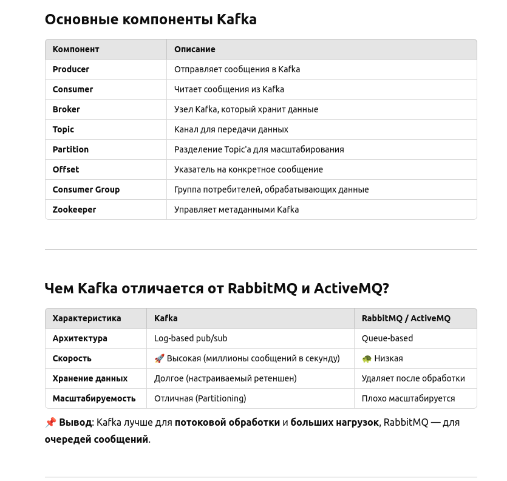
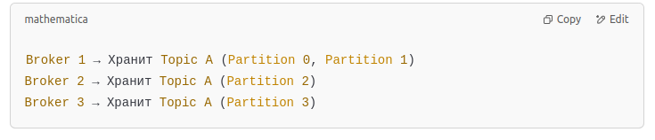
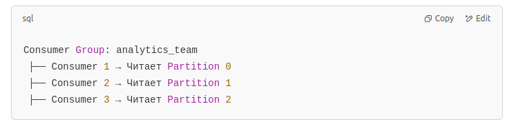
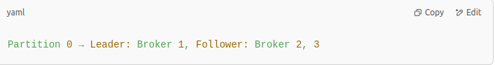
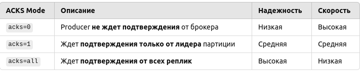
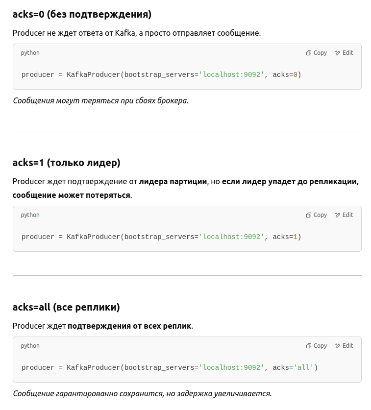
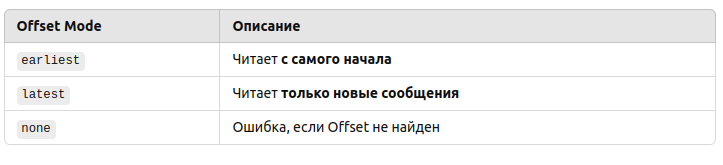

Основы Apache Kafka

Что такое Apache Kafka и зачем он нужен?

Apache Kafka — это распределенная платформа для обработки потоков данных в реальном времени.
Он используется для передачи, хранения и обработки событийных данных с высокой скоростью и отказоустойчивостью.

Примеры использования Kafka:

* Логирование (централизованный сбор логов с серверов)
* Обработка транзакций (банковские операции, платежи)
* Мониторинг и алерты (IoT, DevOps)
* Микросервисная архитектура (общение между сервисами)
* Потоковая аналитика (реагирование на события в реальном времени)

💡 Kafka заменяет традиционные очереди сообщений (RabbitMQ, ActiveMQ), так как лучше масштабируется и быстрее работает.

-----------
Как устроена архитектура Kafka?
Kafka – это pub/sub система (Publisher/Subscriber), состоящая из продюсеров, брокеров и консумеров.

🔹 Основные компоненты Kafka:
* Producer – отправляет сообщения в Kafka.
* Kafka Broker – хранят и управляют данными.
* Kafka Topic  – логические каналы передачи данных.
* Partitions  – делят данные для масштабирования.
* Consumer – читает данные из Kafka.
* Consumer Groups  – балансировка нагрузки.
* Zookeeper – управляет метаданными и координирует брокеры.

💡 Как это выглядит?

Продюсер отправляет данные в Topic.
Kafka делит данные на Partitions.
Консьюмеры считывают данные из партиций.
Zookeeper управляет кластером.

📌 Вывод: Kafka – это масштабируемая, отказоустойчивая система потоковой передачи данных.

----------------
**Что такое Kafka Broker, и что он делает?**

🔹 Kafka Broker – это сервер Kafka, который обрабатывает сообщения.

Что делает Broker?
* Получает сообщения от продюсеров.
* Записывает данные в журнал (log).
* Отдает сообщения консьюмерам.
* Поддерживает партиции и репликацию.

💡 Пример кластера Kafka:

📌 Вывод: Kafka Broker – это центральный компонент, обрабатывающий поток данных.

------------------
Что такое Kafka Topic, и как он работает?

🔹 Kafka Topic – это логический канал передачи данных.

Как работает Kafka Topic?
* Producer отправляет данные в Topic.
* Partitioning делит Topic на подразделения.
* Consumer Groups читают данные из партиций.

💡 Пример создания Topic:

>sh\
>kafka-topics.sh --create --topic user_events --bootstrap-server kafka1:9092 --partitions 3 --replication-factor 2

📌 Вывод: Kafka Topic – это основной канал передачи сообщений.

------------
**Что такое Partitioning (партиционирование) и зачем оно нужно?**
🔹 Partitioning – это разбиение данных на сегменты (партиции) внутри Kafka Topic.
✅ Зачем это нужно?

Масштабируемость → Каждая партиция хранится на отдельном брокере.

Производительность → Данные обрабатываются параллельно.

Гибкость → Разные консьюмеры могут читать данные независимо.

📌 Вывод: Партиционирование ускоряет обработку данных и позволяет масштабировать Kafka.

-----------------------------
**Как работает Offset Management?**
🔹 Offset – это уникальный номер сообщения внутри партиции.
✅ Как Kafka управляет Offset?

Kafka Offset – это позиция чтения сообщений.
Консьюмер отслеживает Offset, чтобы не читать повторно.
Offset можно хранить в Zookeeper или Kafka (Kafka Consumer API).
💡 Пример работы с Offset:

>from kafka import KafkaConsumer\
>\
>consumer = KafkaConsumer('user_events',\
                         group_id='analytics_team',\
                         bootstrap_servers=['kafka1:9092'])
>
>for message in consumer:\
    print(f"Received: {message.value} with offset {message.offset}")

📌 Вывод: Offset управляет потоком данных и предотвращает дублирование.

--------------------
**Что такое Consumer Groups и зачем они нужны?**

🔹 Consumer Group – это группа консьюмеров, обрабатывающих один Topic параллельно.
✅ Зачем это нужно?

Распределение нагрузки – разные консьюмеры читают разные партиции.

Гибкость – можно легко добавить больше консьюмеров.

Масштабируемость – Kafka балансирует потоки сообщений.

sql

📌 Вывод: Consumer Groups позволяют горизонтально масштабировать обработку данных.

--------------
**Как Kafka обеспечивает отказоустойчивость?**

🔹 Kafka использует репликацию, балансировку и Zookeeper.

✅ Механизмы отказоустойчивости:

Репликация партиций → Каждая партиция имеет лидера и реплики.

Автоматическое восстановление → При сбое лидер переключается на другую ноду.

Zookeeper отслеживает состояние кластера.

📌 Вывод: Kafka остается работоспособной даже при сбоях.

-------------
**Как работают репликация и лидерство партиций?**

🔹 Kafka копирует партиции для отказоустойчивости.

Как это работает?

Каждая партиция имеет лидера (Leader) и реплики (Followers).

Только лидер обрабатывает запросы.

Если брокер с лидером упал, новый лидер выбирается среди реплик.

📌 Вывод: Репликация обеспечивает надежность хранения данных.

-------------
**Что такое ISR (In-Sync Replicas) и зачем они нужны?**

🔹 ISR – это список актуальных (синхронизированных) реплик партиции.

Почему это важно?

ISR содержит только актуальные реплики.

Kafka использует ISR для выбора нового лидера при сбоях.

📌 Вывод: ISR защищает данные от потери.

------------------
10. Как работает Zookeeper в Kafka?
🔹 Zookeeper управляет метаданными Kafka.
Что делает Zookeeper?

Отслеживает состояние брокеров.

Выбирает лидеров партиций.

Хранит настройки и метаданные.

📌 Вывод: Zookeeper – это центральный координатор Kafka.

-----------------
**Как Kafka гарантирует порядок сообщений?**

🔹 Kafka гарантирует порядок только внутри одной партиции.

Как это работает?

Сообщения внутри одной партиции приходят строго в порядке.

Если сообщений много → используйте Partition Key.

📌 Вывод: Порядок сохраняется в пределах одной партиции.

--------------------
**Что происходит при отказе брокера Kafka?**

Если брокер падает:

Партиции переходят на резервные брокеры.

Zookeeper выбирает нового лидера.

Консьюмеры продолжают работать.

📌 Вывод: Kafka автоматически восстанавливается после отказа.

------------------
**Как Kafka масштабируется?**

🔹 Kafka горизонтально масштабируется, добавляя новые брокеры.

Как это работает?

Добавляем новые брокеры в кластер.

Перераспределяем партиции через kafka-reassign-partitions.sh.

Балансируем нагрузку.

📌 Вывод: Kafka легко масштабируется горизонтально.

--------------------

# Работа с Producer 

**Как отправить сообщение в Kafka?**

Чтобы отправить сообщение, нужно использовать Kafka Producer API. Producer отправляет данные в топик (topic), и Kafka распределяет их по партициям.

Простейший Producer на Python:

>from kafka import KafkaProducer
>\
producer = KafkaProducer(bootstrap_servers='localhost:9092')\
producer.send('my-topic', b'Hello, Kafka!')\
producer.flush()

bootstrap_servers — адреса Kafka-брокеров

send('my-topic', b'Hello, Kafka!') — отправка сообщения в топик

flush() — отправка накопленных сообщений

----------
**Какие режимы отправки сообщений есть у Producer?**

Kafka поддерживает три режима отправки сообщений:

* Fire and Forget — Producer отправляет сообщение и не ждет подтверждения.
* Synchronous Send (ACKS) — Producer ждет подтверждение от брокера перед отправкой следующего сообщения.
* Asynchronous Send (Callback) — Producer отправляет сообщение и выполняет коллбек, когда брокер подтвердит прием.
-----
**Fire and Forget**

Producer просто отправляет сообщение в Kafka без ожидания подтверждения. Этот способ самый быстрый, но может приводить к потере сообщений.

> producer.send('my-topic', b'Fast message!')

Плюсы: высокая скорость

Минусы: возможная потеря сообщений при сбоях

----
Synchronous Send (ACKS)

Producer ждет подтверждение от брокера, прежде чем отправить следующее сообщение.

future = producer.send('my-topic', b'Synchronous message')
result = future.get()  # Дождаться подтверждения
print(result)

Плюсы: сообщения не теряются

Минусы: медленнее, чем Fire and Forget

---
Asynchronous Send (Callback)
Позволяет асинхронно обработать результат отправки сообщения.

def on_send_success(record_metadata):
    print(f"Message sent to {record_metadata.topic} on partition {record_metadata.partition}")

def on_send_error(ex):
    print(f"Error: {ex}")

producer.send('my-topic', b'Async message').add_callback(on_send_success).add_errback(on_send_error)

Плюсы: асинхронная обработка ошибок

Минусы: сложнее в отладке

--------------
Как работает Kafka Producer API?

* KafkaProducer — создает экземпляр Producer
* send(topic, value) — отправляет сообщение
* flush() — отправляет накопленные сообщения
* close() — закрывает Producer
* acks — настраивает уровень подтверждения доставки

-----------------
Что такое ACKS (Acknowledgment Mode)?

ACKS (Acknowledgment Mode) — это механизм подтверждения доставки сообщений в Kafka.

Producer не ждет ответа от Kafka, а просто отправляет сообщение.

> producer = KafkaProducer(bootstrap_servers='localhost:9092', acks=0)

Сообщения могут теряться при сбоях брокера.

-----------
**Как Producer гарантирует доставку сообщений?**

* Использование acks=all
* Повторная отправка сообщений (retries > 0)
* Использование идемпотентного Producer'а
* Контроль партиционирования (Keyed Partitioner)

--------------
**Как работает Keyed Partitioner?**

Kafka гарантирует, что сообщения с одинаковым ключом попадут в одну партицию.

> producer.send('my-topic', key=b'123', value=b'Important message')

Все сообщения с key=123 попадут в одну партицию.

--------------
**Как настроить Producer для высокой производительности?**

Использовать асинхронную отправку (acks=1)

Увеличить размер batch'ей (batch.size)

Включить сжатие сообщений (compression.type=lz4)

Настроить количество повторных попыток (retries=3)

> producer = KafkaProducer(\
    bootstrap_servers='localhost:9092',\
    compression_type='lz4',\
    batch_size=16384,\
    linger_ms=10
)

------
# Работа с Consumer (Потребителем сообщений)

Как работает Kafka Consumer API?

Kafka Consumer читает данные из топика и обрабатывает их.

> from kafka import KafkaConsumer\
> consumer = KafkaConsumer('my-topic', bootstrap_servers='localhost:9092', auto_offset_reset='earliest')/
for message in consumer:/
    print(f"Received: {message.value}")/

-----
**Что такое Offset Management и зачем он нужен?**

Offset — это позиция сообщения в партиции.

Kafka не удаляет сообщения сразу — Consumer сам отслеживает Offset.

----------
**Как работает Consumer Group и балансировка нагрузки?**

Consumer Group — это группа потребителей, которые совместно читают данные.

Kafka распределяет партиции между Consumer'ами в группе.

Если Consumer выходит из строя, его партиции перераспределяются.

-------
**Что такое Commit Offset и какие есть режимы?**

Автоматический commit (enable.auto.commit=true)
> consumer = KafkaConsumer('my-topic', bootstrap_servers='localhost:9092', enable_auto_commit=True)
> 
Не контролирует offset вручную.

Ручной commit (commitSync() и commitAsync())
consumer.commitSync()  # Ждет подтверждения от Kafka
consumer.commitAsync()  # Асинхронный commit

Позволяет контролировать offset'ы вручную.

-----------------
**Как избежать перегрузки Consumer'а (Backpressure handling)?**

Ограничить количество одновременно обрабатываемых сообщений (max.poll.records)

Настроить таймаут обработки (max.poll.interval.ms)

Использовать параллельную обработку сообщений